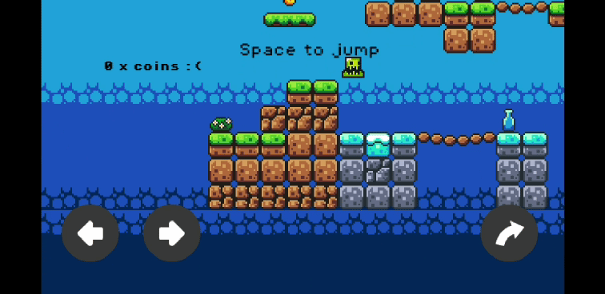

Brackey's Princess
==================

My implementation of the tutorial Brackey's Godot tutorial:

https://www.youtube.com/watch?v=LOhfqjmasi0

Additional features:
====================

## Mobile Controls

Only tested on my android devices, scaling might be broken on other platforms.

## Coin Count

Had weird scaling issue when I embedded Label within Control, looks wrong in editor but right at runtime.

